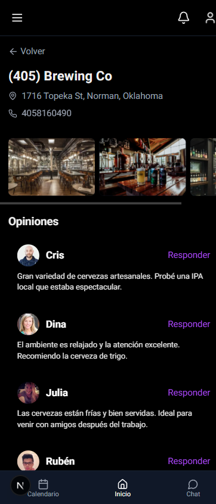

# Prueba Técnica - Aplicación FullStack

Este proyecto consiste en una aplicación FullStack con un cliente (frontend) y un servidor (backend). A continuación, se detallan las instrucciones para ejecutarlo.

## 🚀 Ejecución del Proyecto

Antes de ejecutar el proyecto, asegúrate de haber instalado las dependencias en las carpetas correspondientes.

1. **Instalar dependencias**

   - **Cliente (Frontend):**

     ```bash
     cd client
     npm install
     ```

   - **Servidor (Backend):**

     ```bash
     cd server
     npm install
     ```

2. **Ejecutar el proyecto**

   Puedes ejecutar la aplicación de dos formas:

   1. **Desde la raíz del proyecto** (con `concurrently`):

      ```bash
      npm run dev
      ```

      Esto iniciará tanto el cliente como el servidor automáticamente.

   2. **Por separado**

      **Cliente (Frontend):**

      ```bash
      cd client
      npm run dev
      ```

      **Servidor (Backend)**

      ```bash
      cd server
      npm run start:dev
      ```

## 🔗 Deploy

Puedes acceder a la versión desplegada de la aplicación desde el siguiente enlace:

👉 [Ir al Deploy](https://foodrink-git-deploy-walterhorsts-projects.vercel.app)

## 🔐 Autenticación

Para acceder a la aplicación, es necesario registrarse e iniciar sesión.  
La autenticación es requerida para interactuar con todas las funcionalidades.

---

## 📱💻 Vistas Disponibles

La aplicación cuenta con dos vistas adaptables:

- **Mobile**: Diseño responsivo para dispositivos móviles.
- **Desktop**: Diseño optimizado para pantallas más grandes.

---

## 🖼️ Capturas de Pantalla

<div style="display: flex; gap: 20px; justify-content: center; flex-wrap: wrap;">
  <div>
    <p align="center"><strong>Vista Desktop</strong></p>
    
  </div>
  <div>
    <p align="center"><strong>Vista Mobile</strong></p>
    
    
  </div>

</div>

---

## 📝 Notas

> Asegúrate de tener **Node.js** y **npm** instalados para ejecutar correctamente el proyecto

> He dejado el archivo `.env` dentro de la carpeta **server**, ya que contiene la configuración de la base de datos. Puedes levantar la base de datos con Prisma Studio usando el siguiente comando dentro de la carpeta server:

```bash
npx prisma studio
```
