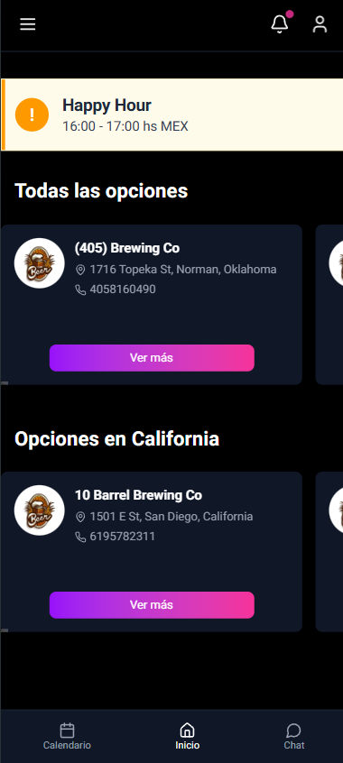
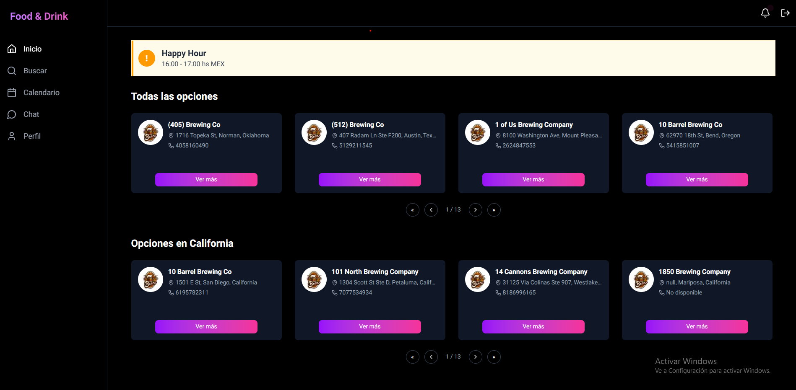

# Prueba Técnica - Aplicación FullStack

Este proyecto consiste en una aplicación FullStack con un cliente (frontend) y un servidor (backend). A continuación, se detallan las instrucciones para ejecutarlo.

## 🚀 Ejecución del Proyecto

Puedes ejecutar la aplicación de dos formas:

1. **Desde la raíz del proyecto** (con concurrently):

   ```bash
   npm run dev
   ```

   Esto iniciará tanto el cliente como el servidor automáticamente.

2. **Por separado**

   **Cliente (Frontend):**

   ```bash
   cd client
   npm run dev
   ```

   **Servidor (Backend)**

   ```bash
   cd server
   npm run start:dev
   ```

## 🔐 Autenticación

Para acceder a la aplicación, es necesario registrarse e iniciar sesión.  
La autenticación es requerida para interactuar con todas las funcionalidades.

---

## 📱💻 Vistas Disponibles

La aplicación cuenta con dos vistas adaptables:

- **Mobile**: Diseño responsivo para dispositivos móviles.
- **Desktop**: Diseño optimizado para pantallas más grandes.

---

## 🖼️ Capturas de Pantalla

## 🖼️ Capturas de Pantalla

| Vista Mobile | Vista Desktop |
|--------------|---------------|
|  |  |


---

## 📝 Notas

> Asegúrate de tener **Node.js** y **npm** instalados para ejecutar correctamente el proyecto
